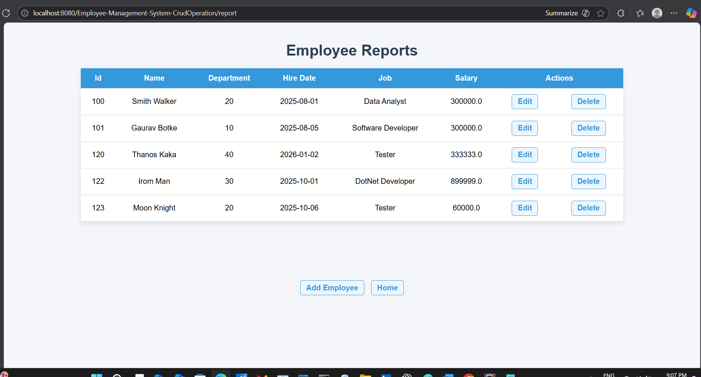
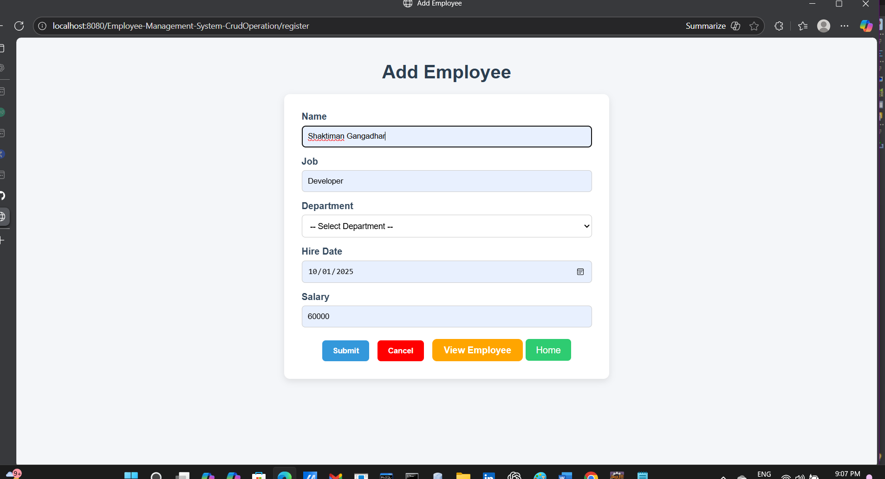
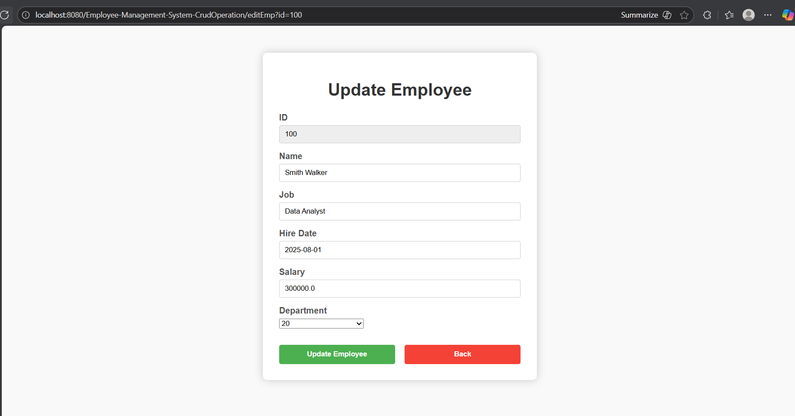

# Employee Management System

A full-stack web application to manage employee records efficiently, including Add, View, Update, and Delete (CRUD) operations. Built with Spring MVC, Hibernate, MySQL, and responsive frontend technologies, this project demonstrates a professional approach to Java-based web development.

---

## Features

- **Add Employee**  
  Easily add new employees to the system with all necessary details like name, email, department, and salary. Input validation ensures data accuracy.

- **View Employees**  
  Display a list of all employees in a clean, tabular format. Supports easy navigation and search for quick access to employee information.

- **Update Employee**  
  Update existing employee details such as job title, department, or salary. Ensures smooth editing while maintaining data integrity.

- **Delete Employee**  
  Remove employees from the system safely. Includes a **confirmation prompt** to prevent accidental deletion.

- **Responsive Frontend**  
  Built with **HTML, CSS, Bootstrap, and JavaScript** for a modern, mobile-friendly UI.

- **Form Validation**  
  Both client-side and server-side validation to ensure no invalid data is entered into the database.

---

## Technologies Used

- **Backend:** Java, Spring MVC, Spring Data JPA, Hibernate  
- **Database:** MySQL / Oracle DB  
- **Frontend:** HTML, CSS, Bootstrap, JavaScript  
- **Build Tools:** Maven / Gradle  
- **IDE:** Eclipse (with Spring Tool Suite)

---

- ## Project Structure

EmployeeManagementSystem/
│
├── src/main/java/ → Java source files (Controllers, Services, Models)
├── src/main/resources/ → Application properties
├── src/main/webapp/ → JSP pages, CSS, JS, and image assets
├── pom.xml / build.gradle → Project build and dependency management
└── README.md → Project documentation


---

## Setup & Installation

1. **Clone the repository:**
   ```bash
   git clone https://github.com/yourusername/EmployeeManagementSystem.git
Import into Eclipse:

File → Import → Existing Maven/Gradle Project → Select project folder.

Configure Database:

Update hibernate.cfg.xml or application.properties with your DB credentials.

Run the Project:

Right-click project → Run As → Spring Boot App / Dynamic Web Project.

Access the Application:

Open browser → http://localhost:8080/

---

Screenshots

Home Page


View Employee


Add Employee


Edit Employee


-----

Future Improvements

Add authentication and authorization for secure access.

Implement pagination and search filters for large employee lists.

Enhance UI with modern frameworks like React or Angular.

--

Author

Your Name – Gaurav-Botke


